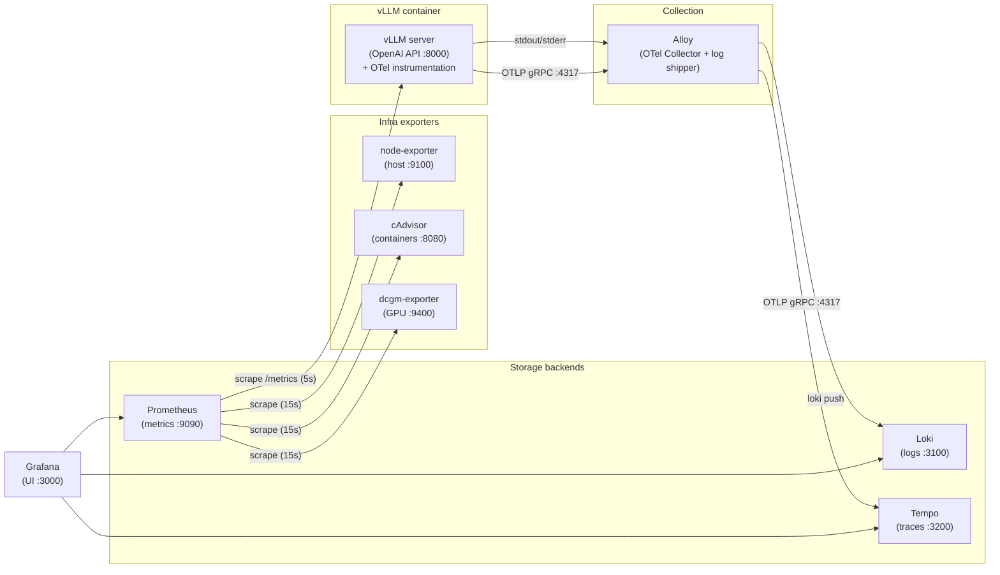
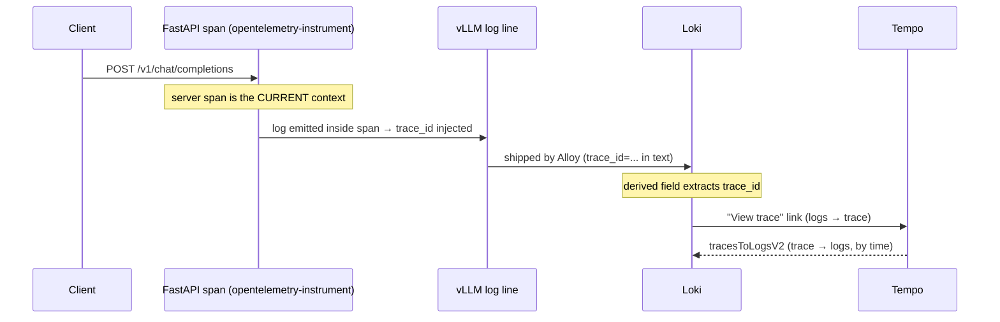

# Observability Stack

This folder holds a self-contained **metrics + logs + traces** stack for the
vLLM inference server, wired together with Grafana so the three signals can be
correlated. Everything runs via the root [`docker-compose.yml`](../docker-compose.yml).

- **Metrics** — Prometheus scrapes vLLM's `/metrics` plus infra exporters
  (host, per-container, GPU); Grafana visualizes them.
- **Logs** — Alloy tails container stdout/stderr into Loki.
- **Traces** — vLLM emits OTLP spans to Alloy, which forwards them to Tempo.
- **Correlation** — trace→logs (by time) and logs→trace (by `trace_id`).

> For the **vLLM-side** detail (metric names, log format, `llm_request` span
> attributes, the instrumentation wrapper, and trace unification) see
> [`vllm-instrumentation.md`](./vllm-instrumentation.md).

---

## Architecture



`Alloy` plays two roles at once: the **OpenTelemetry Collector** for traces
*and* the **log shipper** (Promtail successor) for logs. That is why there is no
separate `otel-collector` service — Alloy already contains those components.

---

## Services & roles

| Service | Image | Port | Role | Config |
|---|---|---|---|---|
| **vllm** | `vllm/vllm-openai` | 8000 | Inference server; source of all three signals | [`../vllm/configs/bf16.yaml`](../vllm/configs/bf16.yaml), [`../vllm/entrypoint.sh`](../vllm/entrypoint.sh), [`otel/`](./otel) |
| **prometheus** | `prom/prometheus` | 9090 | Scrapes & stores vLLM metrics | [`prometheus.yml`](./prometheus.yml) |
| **loki** | `grafana/loki` | 3100 | Stores logs | [`loki/config.yml`](./loki/config.yml) |
| **tempo** | `grafana/tempo` | 3200 | Stores traces (OTLP receiver on 4317/4318) | [`tempo/config.yml`](./tempo/config.yml) |
| **alloy** | `grafana/alloy` | 4317/4318 (in-network) | Collector: logs→Loki, traces→Tempo | [`alloy/config.alloy`](./alloy/config.alloy) |
| **grafana** | `grafana/grafana` | 3000 | Dashboards + correlation UI | [`grafana/provisioning/`](./grafana/provisioning) |
| **node-exporter** | `prom/node-exporter` | 9100 (in-network) | Host CPU/mem/disk/net metrics | compose flags |
| **cadvisor** | `ghcr.io/google/cadvisor` | 8080 (in-network) | Per-container resource usage | compose flags |
| **dcgm-exporter** | `nvcr.io/nvidia/k8s/dcgm-exporter` | 9400 (in-network) | NVIDIA GPU metrics | [`dcgm/counters.csv`](./dcgm/counters.csv) |

Ports and image tags are overridable via [`.env`](../.env.example). The three
infra exporters are **Prometheus-only** — they publish no host ports.

---

## The three pillars

### 1. Metrics (Prometheus → Grafana)

vLLM exposes Prometheus metrics at `/metrics` with no extra flags. Prometheus
scrapes `vllm:8000` every 5s ([`prometheus.yml`](./prometheus.yml)) and Grafana
auto-loads the official vLLM dashboard.

> **Config note:** the provisioned dashboard binds to a **fixed datasource UID**
> `vllm-prometheus`, and its `model_name` variable is left empty so Grafana
> auto-selects whatever model vLLM is actually serving.

#### Infra exporters

Beyond vLLM's app metrics, three exporters cover the machine underneath
(scraped every 15s):

| Exporter | Answers | Grafana dashboard |
|---|---|---|
| **node-exporter** | Is the *host* CPU/RAM/disk/network saturated? | Node Exporter Full (1860) |
| **cAdvisor** | Which *container* is using resources? | Cadvisor exporter (14282) |
| **dcgm-exporter** | Is the *GPU* utilization/VRAM/power/temp healthy? | NVIDIA DCGM (12239) |

The dashboards are downloaded from grafana.com and rebound to the
`vllm-prometheus` datasource UID (their `${DS_PROMETHEUS}` input is replaced and
`__inputs` removed) so they provision without manual mapping.

> **GPU config note (consumer GeForce):** [`dcgm/counters.csv`](./dcgm/counters.csv)
> is a **trimmed** counters file. It keeps only NVML-backed `DCGM_FI_DEV_*`
> fields (util, VRAM, power, temp, clocks) and drops the `DCGM_FI_PROF_*`
> profiling fields, which require datacenter GPUs and are unsupported on a
> GeForce (e.g. RTX 3090). Stock counters would emit empty/errored series.

> **cAdvisor config note (snap Docker):** the usual `/var/lib/docker` mount is
> omitted because this host runs snap Docker (data lives under `/var/snap/...`);
> bind-mounting the missing path fails. Per-container metrics still work via
> cgroups — only image/layer disk stats are unavailable.

### 2. Logs (Alloy → Loki → Grafana)

`Alloy` discovers running containers over the Docker socket, relabels
`__meta_docker_container_name` into a clean `container="vllm"` label, tails
stdout/stderr, and pushes to Loki.

> **Config notes:**
> - Alloy runs as `user: root` to read `/var/run/docker.sock`.
> - Loki is single-binary/filesystem storage. The `ring` block must use
>   `kvstore: { store: inmemory }` (a bare `kind: inmemory` crashes Loki).

### 3. Traces (vLLM → Alloy → Tempo → Grafana)

vLLM's `--otlp-traces-endpoint` ([`bf16.yaml`](../vllm/configs/bf16.yaml)) points at
`alloy:4317`. Alloy receives OTLP, batches, and exports to `tempo:4317`.
`OTEL_SERVICE_NAME=vllm` names the spans in Tempo.

---

## Log ↔ Trace correlation

This is the tricky part and the reason for the `otel/` folder and the
`opentelemetry-instrument` launch wrapper.

### The problem

vLLM's native `llm_request` span is built **post-hoc** (with explicit
start/end timestamps *after* the request finishes). It is never the "current"
span while the request runs, so log lines emitted during the request cannot see
it — they'd always print `trace_id=0`.

### The fix: FastAPI auto-instrumentation

vLLM is launched under `opentelemetry-instrument` (see
[`../vllm/entrypoint.sh`](../vllm/entrypoint.sh)), which activates two instrumentations:

- **FastAPI** — opens an HTTP **server span** that stays the *current context*
  for the whole request. Now anything logged during the request sees a real span.
- **Logging** — a log-record factory injects `otelTraceID` / `otelSpanID` into
  every `LogRecord` (enabled by `OTEL_PYTHON_LOG_CORRELATION=true`).

The custom vLLM logging config ([`otel/vllm-logging.json`](./otel/vllm-logging.json))
then **prints** those fields, so log lines look like:

```
INFO 08-29 11:21:03 [httptools_impl.py:485] [trace_id=05a5...e09b2b span_id=3389...bda6] 172.20.0.1 - "POST /v1/chat/completions HTTP/1.1" 200
```

Finally, the Loki datasource has a **derived field**
([`grafana/provisioning/datasources/datasources.yml`](./grafana/provisioning/datasources/datasources.yml))
that regex-extracts `trace_id=<32hex>` and turns it into a **"View trace"** link
to Tempo.



### Two correlation directions

| Direction | Mechanism | Where configured |
|---|---|---|
| **trace → logs** | time + `{container="vllm"}` query | Tempo datasource `tracesToLogsV2` |
| **logs → trace** | `trace_id=<hex>` derived field | Loki datasource `derivedFields` |

### Known limitation: two traces per request

Each request currently produces **two separate traces** with different IDs:

| Trace | Source | Contents | Carries log `trace_id`? |
|---|---|---|---|
| FastAPI HTTP trace | `opentelemetry-instrument` | server span + `http send`/`receive` | ✅ yes |
| `llm_request` trace | vLLM native (`otlp-traces-endpoint`) | TTFT, queue time, token counts | ❌ no |

They don't merge because vLLM parents `llm_request` off inbound `traceparent`
**headers**, which local clients (curl / GuideLLM) don't send. So a log's
"View trace" link lands on the HTTP trace (timing/status), not the rich
`llm_request` one.

**To unify (optional):** either have the client send `traceparent` headers
(links all spans into one trace), or drop vLLM's native `otlp-traces-endpoint`
and rely solely on FastAPI spans (simpler, but loses the TTFT/token detail).

---

## Accessing the stack

| UI | URL | Default login |
|---|---|---|
| Grafana | http://localhost:3000 | `admin` / `admin` |
| Prometheus | http://localhost:9090 | — |
| Tempo (API) | http://localhost:3200 | — |
| Loki (API) | http://localhost:3100 | — |

```bash
# bring the whole stack up
docker compose up -d

# generate some traffic (see notebooks/03-benchmark-eval.ipynb for load tests)
curl -s localhost:8000/v1/chat/completions -H 'Content-Type: application/json' \
  -d '{"model":"Qwen/Qwen3-0.6B","messages":[{"role":"user","content":"hi"}],"max_tokens":16}'
```

In Grafana: **Explore → Loki** (`{container="vllm"}`) → click a log line →
**View trace** to jump to Tempo; or **Explore → Tempo** → open a trace →
**Logs for this span** to jump back to Loki.

---

## Config file map

```
observability/
├── prometheus.yml                    # scrape vllm + node/cadvisor/dcgm exporters
├── loki/config.yml                   # single-binary Loki, filesystem storage
├── tempo/config.yml                  # single-binary Tempo, OTLP receiver + local storage
├── alloy/config.alloy                # logs (→Loki) + OTLP traces (→Tempo)
├── otel/vllm-logging.json            # vLLM log format that prints trace_id/span_id
├── dcgm/counters.csv                 # trimmed GPU counters (GeForce-safe)
└── grafana/
    ├── provisioning/
    │   ├── datasources/datasources.yml  # Prometheus + Loki(+derivedField) + Tempo(+tracesToLogsV2)
    │   └── dashboards/dashboards.yml     # auto-load dashboards from disk
    └── dashboards/
        ├── vllm.json                 # official vLLM metrics dashboard
        ├── vllm-logs.json            # logs dashboard
        ├── node-exporter-full.json   # host metrics (grafana.com 1860)
        ├── cadvisor.json             # per-container metrics (grafana.com 14282)
        └── nvidia-dcgm.json          # GPU metrics (grafana.com 12239)
```

> **Note:** `datasources.yml` provisions **all three** datasources
> (Prometheus, Loki, Tempo) plus the correlation config.
