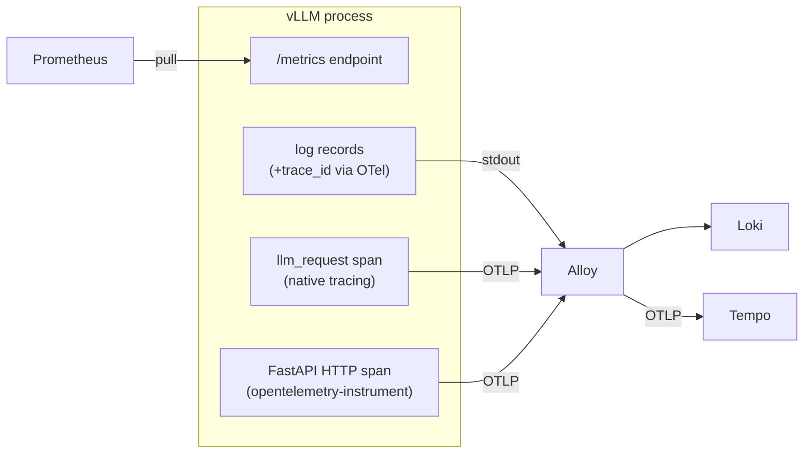

# vLLM Instrumentation: Metrics, Logging & Traces

This doc covers the **vLLM side** of observability — how the server produces
metrics, logs, and traces, and how we instrument it so the three correlate.
For the surrounding stack (Prometheus/Loki/Tempo/Grafana/Alloy) see
[`README.md`](./README.md).

## The three signals at a glance

| Signal | Emitted by | Transport | Config |
|---|---|---|---|
| **Metrics** | vLLM built-in `/metrics` | Prometheus **pulls** | none (on by default) |
| **Logs** | Python logging → stdout | Alloy tails → Loki **push** | [`otel/vllm-logging.json`](./otel/vllm-logging.json) |
| **Traces** | OTel SDK (native + FastAPI) | OTLP **push** → Alloy → Tempo | [`../vllm/configs/bf16.yaml`](../vllm/configs/bf16.yaml), [`../vllm/entrypoint.sh`](../vllm/entrypoint.sh) |



---

## 1. Metrics

vLLM exposes a Prometheus endpoint at **`/metrics`** with no serve flags
required. Prometheus scrapes `vllm:8000` (see [`prometheus.yml`](./prometheus.yml)).
All series are prefixed `vllm:`. Key families:

| Area | Metric | Notes |
|---|---|---|
| Load | `vllm:num_requests_running`, `vllm:num_requests_waiting` | live scheduler queue |
| KV cache | `vllm:kv_cache_usage_perc` | `1.0` = 100% full |
| Prefix cache | `vllm:prefix_cache_hits_total` / `vllm:prefix_cache_queries_total` | hit rate = hits/queries |
| Throughput | `vllm:prompt_tokens_total`, `vllm:generation_tokens_total` | rate() for tokens/s |
| Latency (histograms) | `vllm:time_to_first_token_seconds`, `vllm:inter_token_latency_seconds`, `vllm:e2e_request_latency_seconds` | use `histogram_quantile()` |
| Phase timing | `vllm:request_queue_time_seconds`, `vllm:request_prefill_time_seconds`, `vllm:request_decode_time_seconds`, `vllm:request_inference_time_seconds` | per-request phases |
| Outcomes | `vllm:request_success_total` | labeled by finish reason |

> **KV cache lives here, not in traces.** GPU *hardware* metrics (util, VRAM,
> power, temp) come from **dcgm-exporter**, not vLLM — see the README.

---

## 2. Logging

### Default behavior

vLLM configures Python logging itself and writes to **stdout**, which Docker
captures and **Alloy** tails into **Loki** (labeled `container="vllm"`). No app
changes are needed for logs to reach Grafana.

### Trace-id injection (what we added)

To correlate a log line with a trace, each log record needs the active
trace/span id. Two pieces make that happen:

1. **`LoggingInstrumentor`** (from `opentelemetry-instrumentation-logging`),
   activated by the `opentelemetry-instrument` wrapper with
   `OTEL_PYTHON_LOG_CORRELATION=true`. It installs a log-record factory that
   adds `otelTraceID` / `otelSpanID` to **every** record.
2. **A custom log format** ([`otel/vllm-logging.json`](./otel/vllm-logging.json),
   pointed to by `VLLM_LOGGING_CONFIG_PATH`) that actually **prints** those
   fields:

```
%(levelname)s %(asctime)s [%(filename)s:%(lineno)d] [trace_id=%(otelTraceID)s span_id=%(otelSpanID)s] %(message)s
```

Result — request lines carry a real id (health/metrics/stats lines are `0`):

```
INFO 08-29 11:21:03 [httptools_impl.py:485] [trace_id=05a5...e09b2b span_id=3389...bda6] "POST /v1/chat/completions HTTP/1.1" 200
```

Grafana's Loki datasource has a **derived field** that turns `trace_id=<32hex>`
into a **"View trace"** link (see [`README.md`](./README.md#log--trace-correlation)).

> **Gotcha:** with `opentelemetry-instrumentation-logging >= 0.61b0` the record
> factory is a **no-op unless `set_logging_format=True`** (which
> `OTEL_PYTHON_LOG_CORRELATION=true` sets). With it off, no ids are attached.

---

## 3. Traces

There are **two independent span sources** in the one vLLM process:

### 3a. Native `llm_request` span (vLLM's own tracing)

Enabled by `otlp-traces-endpoint` in [`bf16.yaml`](../vllm/configs/bf16.yaml). vLLM builds
one span per request with rich `gen_ai.*` attributes:

| Attribute | Meaning |
|---|---|
| `gen_ai.latency.time_to_first_token` | TTFT (s) |
| `gen_ai.latency.time_in_queue` | queue wait (s) |
| `gen_ai.latency.time_in_model_prefill` | prefill (s) |
| `gen_ai.latency.time_in_model_decode` | decode (s) |
| `gen_ai.latency.e2e` | end-to-end (s) |
| `gen_ai.usage.prompt_tokens` / `completion_tokens` | token counts |
| `gen_ai.request.id` | e.g. `chatcmpl-…` |
| `gen_ai.request.max_tokens` / `temperature` / `top_p` / `n` | sampling params |

View in Grafana → Explore → Tempo:

```
{ name = "llm_request" }
{ name = "llm_request" && gen_ai.latency.e2e > 1 }
```

> **Why logs can't see this span:** `llm_request` is built **post-hoc**
> (explicit start/end timestamps *after* the request finishes), so it is never
> the "current" span while the request runs. That's why we also add FastAPI
> instrumentation below.

### 3b. FastAPI HTTP span (`opentelemetry-instrument`)

The `opentelemetry-instrument` wrapper + `opentelemetry-instrumentation-fastapi`
open an HTTP **server span** that *is* the current context for the whole
request — so logs emitted during the request get a real `trace_id`. This span
also has child `http receive` / `http send` events (one `send` per streamed
response chunk — normal for SSE).

### The two-traces caveat & how to unify

By default each request yields **two traces** (different ids): the FastAPI HTTP
trace (carries the log `trace_id`) and the native `llm_request` trace (rich
detail). They don't merge because vLLM parents `llm_request` off the inbound
**`traceparent`** header, not the in-process span.

**Fix:** send a `traceparent` header and both attach to one trace. See the
"Unify the trace" bonus cell in [`../notebooks/03-benchmark-eval.ipynb`](../notebooks/03-benchmark-eval.ipynb):

```python
traceparent = f"00-{secrets.token_hex(16)}-{secrets.token_hex(8)}-01"
client.chat.completions.create(..., extra_headers={"traceparent": traceparent})
```

---

## 4. Instrumentation plumbing

### Dependencies ([`../vllm/entrypoint.sh`](../vllm/entrypoint.sh))

The OTel **SDK/API/exporter/semconv** are already bundled in the vLLM image.
Only the **instrumentation** packages are installed at startup, and only when
`otlp-traces-endpoint` is set in the serve config:

- `opentelemetry-instrumentation-fastapi` — HTTP server span
- `opentelemetry-instrumentation-logging` — trace-id in log records

vLLM is then launched as `opentelemetry-instrument vllm serve …` (falls back to
a plain `vllm serve` when tracing is disabled).

### Environment ([`../docker-compose.yml`](../docker-compose.yml))

| Variable | Purpose |
|---|---|
| `OTEL_SERVICE_NAME=vllm` | names spans in Tempo |
| `OTEL_TRACES_EXPORTER=otlp` | export via OTLP |
| `OTEL_EXPORTER_OTLP_TRACES_ENDPOINT=http://alloy:4317` | send to Alloy |
| `OTEL_EXPORTER_OTLP_TRACES_PROTOCOL=grpc` + `_INSECURE=true` | gRPC, no TLS |
| `OTEL_METRICS_EXPORTER=none`, `OTEL_LOGS_EXPORTER=none` | metrics via Prometheus pull; logs via Alloy — don't double-export |
| `OTEL_PYTHON_LOG_CORRELATION=true` | attach trace ids to log records |
| `VLLM_LOGGING_CONFIG_PATH=/etc/otel/vllm-logging.json` | print those ids |

> **Note:** we do **not** set `PYTHONPATH` to a custom `sitecustomize` — that
> would shadow the wrapper's own `sitecustomize` and silently disable
> auto-instrumentation. Let `opentelemetry-instrument` own it.

> **Note:** installing `opentelemetry-instrumentation-fastapi` pulls a slightly
> newer `opentelemetry-api`. vLLM's native tracing still works; pin versions if
> you want reproducible rebuilds.

---

## 5. Correlation summary

| From | To | Mechanism |
|---|---|---|
| Log line | Trace | derived field on `trace_id=<hex>` → Tempo |
| Trace | Logs | `tracesToLogsV2` (time + `{container="vllm"}`) |
| Metric spike | Logs/Trace | pivot by time in Grafana |
| One request | One trace | send `traceparent` header (unifies FastAPI + `llm_request`) |

## Quick reference

```bash
# metrics
curl -s localhost:8000/metrics | grep '^vllm:' | head

# a traced request (unified trace) — see printed trace id, open in Tempo
python - <<'PY'
import secrets, json, urllib.request
tp=f"00-{secrets.token_hex(16)}-{secrets.token_hex(8)}-01"
b=json.dumps({"model":"Qwen/Qwen3-0.6B","messages":[{"role":"user","content":"hi"}],"max_tokens":16}).encode()
urllib.request.urlopen(urllib.request.Request("http://localhost:8000/v1/chat/completions",b,
  {"Content-Type":"application/json","traceparent":tp})).read()
print("trace:", tp.split("-")[1])
PY
```
